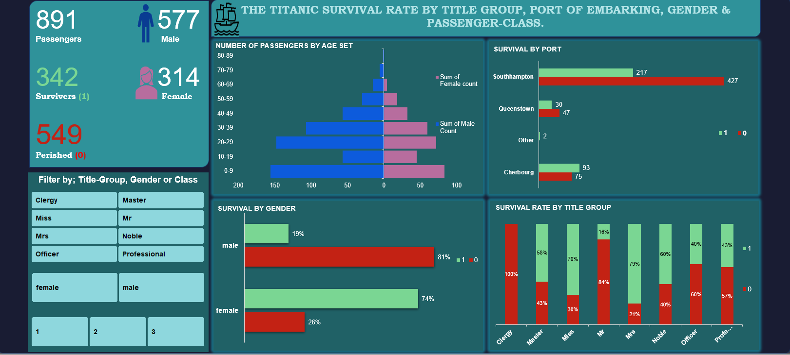

# Data Analysis Projects 
## [Project 1:The Titanic Survival Rate Analysis](https://github.com/nobeardguy/Titanic-survival-rate-analysis)
This is a project i did to analyse the survival rate for people on board the famous ship; The Titanic.
- Data was taken from Kaggle.com
- I used Microsft Excel for the whole project.
- It was my first end-end project using Microsoft Excel.
  

# [Project 2:A Chocolate Shop Sales Analysis](https://github.com/nobeardguy/chocolateSalesShopAnalysis)
- 

  
# [Project 3:A Car Sales Analysis](https://github.com/nobeardguy/CarSalesAnalysis)

This is a sales analysis for a car selling company from the year 1984 - 2022.
- Data used was from Kaggle.com
- I combined SQL and PowerBi to clean and visualize the data.

# [Project 4:A Student Report Generator](https://github.com/nobeardguy/CBC-Students-Report-Generator) 
- I was trying to ease the work done by teachers who have to generate examination results for learners. Sometimes, 
the number of learners might be too large to be done manually and the school finances too limited to access paid services like Zeraki software.
- Data used was from students in a CBE class in Garissa County.
- I used Python and Microsoft Word to complete the project.

